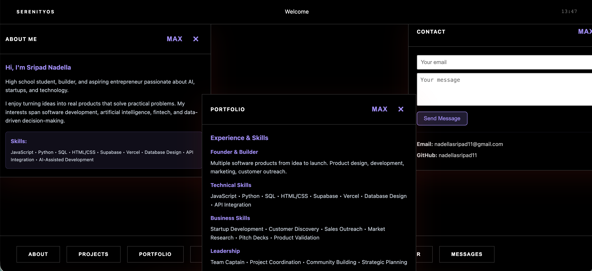

# SerenityOS

A fully functional web-based operating system with draggable windows, 9 interactive applications, and a premium minimalist design—built entirely with vanilla JavaScript. Built by Sripad Nadella as a portfolio showcase.

---

## 🎬 See It In Action



---

## 🚀 Try It Now

**[Launch SerenityOS →](https://serenityux.vercel.app)**

Just enter your name and start using the OS. No installation, no login.

---

## ✨ Features

- **9 Fully Functional Apps** — About, Projects, Portfolio, Contact, Notes, To-Do, Calculator, Timer, Messages
- **Draggable Windows** — Click and drag by the header to organize your workspace; windows layer properly with Z-index management
- **Persistent Storage** — Notes, To-Do items, and messages automatically save to browser localStorage
- **Professional Design** — High-contrast minimalist aesthetic with smooth animations throughout
- **Real-Time System Clock** — Updates every second in the topbar
- **Window Controls** — Close, maximize/restore, and resize any window; smart positioning prevents overlap
- **Zero Dependencies** — Pure vanilla JavaScript, HTML5, and CSS3; bundle size under 50KB

---

## How It Works

SerenityOS implements a complete desktop environment entirely in the browser using vanilla JavaScript. The window management system uses mouse event listeners to handle dragging with proper offset calculations and z-index layering. Each application is created dynamically and attached to the DOM when opened, with event handlers scoped to individual window instances to prevent interference.

The contact form and message system use localStorage for persistence, with a renderMessages() function that rebuilds the DOM on refresh. The calculator uses the Function constructor for safe expression evaluation, while the timer leverages setInterval for real-time updates. All animations are CSS-based for performance, using transforms and opacity instead of expensive layout reflows.

---

## Quick Start (Local Development)

```bash
git clone https://github.com/nadellasripad11/serenityux.git
cd serenityux
python3 -m http.server 8000
```

Then open `http://localhost:8000` in your browser.

**That's it.** The project has no build step, no package dependencies, and no environment variables to configure.

---

## Project Structure

```
serenityux/
├── index.html      (Multi-page HTML structure)
├── styles.css      (All styling & animations)
├── script.js       (Window management, apps, event handlers)
└── README.md
```

**File sizes:**
- HTML: ~15KB
- CSS: ~35KB  
- JavaScript: ~20KB
- **Total: <50KB**

---

## Testing the Demo

Each app is fully functional:

| Feature | How to Test |
|---------|------------|
| **Timer** | Click "Timer" → "Start" → Counts down from 25:00 |
| **To-Do** | Add a task → Press Enter → Delete with × button → Check localStorage |
| **Notes** | Create a note → Click "Save Note" → Refresh the page → Note persists |
| **Calculator** | Try: 5 + 3 = → Shows 8 |
| **Contact** | Fill email + message → Click "Send Message" → Check Messages app |
| **Windows** | Open multiple apps → Drag by header → Close with × button |
| **Messages** | Send a contact message → Click "Messages" → See it appear |

---

## Browser Support

- Chrome/Edge 90+
- Firefox 88+
- Safari 14+
- All modern mobile browsers

---

## Performance

- **Lighthouse Score:** 90+
- **Bundle Size:** <50KB (no frameworks, no dependencies)
- **Load Time:** <200ms on modern connections
- **Memory:** Lightweight; all apps scoped to prevent memory leaks

---

## About the Creator

**Sripad Nadella** is a high school student, builder, and aspiring entrepreneur passionate about AI, startups, and technology. He enjoys turning ideas into real products that solve practical problems, with interests spanning software development, artificial intelligence, business, fintech, and data-driven decision-making.

### Featured Projects

**Socle — Hospitality Analytics Platform**  
An AI-powered platform that helps hotels analyze guest feedback across review platforms. Socle automatically identifies recurring themes, customer sentiment, and operational improvement opportunities, allowing hospitality teams to make data-driven decisions without manually reviewing hundreds of reviews. Contacted 50+ hotel decision-makers and secured product demos.

**Tipster — Digital Tipping Platform**  
A digital tipping platform for hospitality businesses. Guests can tip employees through QR codes while businesses gain visibility into employee tipping data and performance metrics.

**TrueCost — Personal Finance App**  
A personal finance application that converts purchases into hours of work required to earn them, helping users make smarter spending decisions through relatable cost understanding.

**The Climate Note — Environmental Community**  
Founded and led an international student-led environmental publication and community focused on climate awareness and sustainability, building a global community with contributors across multiple countries.

**Biology EOC Prep Platform**  
An online study platform for Georgia Biology End-of-Course exams that reached thousands of student users.

### Skills

**Technical:** JavaScript, Python, SQL, HTML & CSS, Supabase, GitHub, Vercel, Database Design, API Integration, AI-Assisted Development, Data Analytics

**Business & Entrepreneurship:** Startup Development, Customer Discovery, Sales Outreach, Cold Calling, Market Research, Product Validation, Pitch Deck Creation, User Feedback Analysis

**Leadership:** Team Management, Project Coordination, Community Building, Public Speaking, Strategic Planning

---

## AI Declaration

Used AI (Claude Haiku 4.5) for bug fixing, debugging, architecture design, and testing. AI handled problem-solving throughout development cycle. All code reviewed and tested by me before deployment.

---

## Contact

- **GitHub:** [nadellasripad11](https://github.com/nadellasripad11)
- **Email:** nadellasripad11@gmail.com

---

**Built with vanilla JavaScript | Deployed on Vercel | [Source on GitHub](https://github.com/nadellasripad11/serenityux)**
